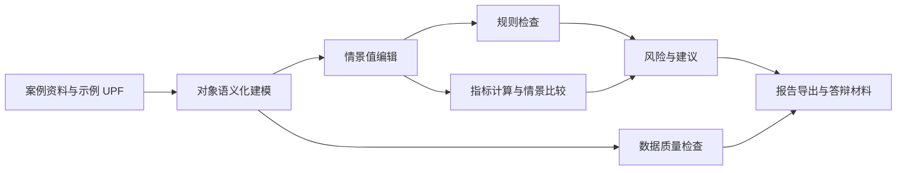

# UrbanPlan Studio 硕士毕业设计方案

## 1. 课题定位

UrbanPlan Studio 是一个面向城市更新与城市规划硕士毕业设计的软件原型。它不以替代 ArcGIS、CityEngine、CAD 或成熟数字孪生平台为目标，而是聚焦在毕业设计、课程设计和早期方案推演中最常见的痛点：规划对象语义不清、方案指标分散、规则校核依赖人工经验、情景比较难以复现、成果报告缺少证据链。

本课题可定位为“面向城市更新方案推演的语义化规划原型系统设计与评价”。其中，软件原型是研究载体，核心研究问题是：如何把城市更新设计中的地块、道路、设施、开敞空间、保护控制区、情景方案、规则校核和证据来源组织成一个可编辑、可计算、可比较、可追溯的轻量化工作流。

## 2. 研究背景与问题

城市更新项目通常具有小尺度、多利益主体、多目标约束和快速迭代等特点。硕士毕业设计阶段常见的工作方式是 CAD 绘图、表格算量、文本说明和人工规范核查并行推进。这种方式可以表达设计结果，但在研究与答辩场景中存在以下问题：

1. 方案图形与规划语义脱节。地块边界、道路、设施点位和保护范围虽然可绘制，但其属性、约束和情景值常散落在图纸、表格和说明文字中。
2. 指标计算与规则判断难以复现。容积率、绿地率、建筑密度、设施服务能力等结果经常依赖手算或临时表格，答辩时不易解释计算来源。
3. 情景比较不够结构化。不同更新策略之间的容量、公共服务、保护风险和数据质量差异缺少统一口径。
4. 证据链不足。规范条文、规划条件、调研数据、专家判断和原型假设没有被清晰区分，容易造成“看起来精确但依据不明”的问题。
5. 原型系统与论文评价之间断裂。很多软件类毕业设计能展示功能，但缺少可检验的评价指标、实验任务和案例验证流程。

UrbanPlan Studio 以本地优先的桌面原型为载体，尝试把设计对象转化为 UPF 语义规划格式，并围绕规则检查、数据质检、情景比较和报告导出建立闭环。

## 3. 研究目标

本课题的总体目标是构建并验证一个面向城市更新早期方案推演的轻量化规划原型系统，使规划方案能够在“语义建模、情景编辑、规则校核、指标比较、证据报告”之间形成可复现流程。

具体目标包括：

1. 建立适用于原型阶段的语义规划数据模型，将地块、道路、出入口、公共服务设施、开敞空间、约束覆盖区和情景方案统一组织。
2. 设计面向城市更新方案的规则检查机制，支持强度控制、绿地率、建筑密度、公共服务能力、出入口风险和历史保护覆盖风险等校核。
3. 构建情景化编辑与比较流程，使不同更新策略能够在同一对象体系下比较指标变化、风险变化和数据质量变化。
4. 建立数据质量与证据链表达方法，区分法定规则、地方技术要求、专项规划要求、设计指引和原型假设。
5. 通过案例验证和用户任务实验评价原型的有效性、可用性、可靠性和研究边界。

## 4. 研究问题

本课题可围绕以下研究问题展开：

1. RQ1：如何用轻量化语义数据模型表达城市更新方案中的空间对象、控制指标、情景值和证据来源？
2. RQ2：如何将规划规则检查组织为可解释、可追溯、可扩展的原型规则引擎？
3. RQ3：在毕业设计与早期方案推演场景中，情景比较和数据质检能否提高方案分析的效率与一致性？
4. RQ4：系统输出的风险提示、指标表和报告内容能否支撑答辩中的方案论证，而不是只作为界面展示？
5. RQ5：在不接入完整 GIS/BIM/数字孪生平台的前提下，本地轻量原型的能力边界在哪里？

## 5. 用户与使用场景

目标用户包括城市规划、城乡规划、建筑学或城市设计方向的研究生，以及需要快速整理城市更新方案的教学或研究团队。

典型场景包括：

1. 老旧住区更新：比较保留修缮、局部拆建和综合提升等策略对容量、绿化、设施缺口和保护风险的影响。
2. 街区微更新：在道路出入口、公共服务设施和开敞空间调整中检查基础规则和服务覆盖。
3. 历史风貌片区更新：识别更新地块与保护控制覆盖区的空间关系，提示拆建行为可能带来的合规风险。
4. 毕业设计答辩准备：从原型中导出情景比较、数据质量结果和规则检查报告，作为设计说明书的证据材料。

## 6. 系统方案

### 6.1 功能范围

当前原型围绕以下工作流组织：

1. 导入或载入 UPF/demo 项目。
2. 在画布上查看地块、道路、设施、出入口、开敞空间和约束覆盖区。
3. 选择对象并编辑规划属性、控制指标和情景值。
4. 运行规划规则检查，生成问题、风险等级和建议。
5. 对比不同情景方案的容量、风险和服务指标。
6. 执行数据质量检查，识别缺失证据、原型规则和引用完整性问题。
7. 导出 UPF、保存项目或生成 Markdown 报告。

### 6.2 数据模型

系统采用 UPF 作为内部语义规划格式。UPF 不是 CAD 图层，也不是完整 GIS 数据库，而是面向规划推演的中间表达。其核心对象包括：

1. `Parcel`：规划地块，包含边界点、用地类型、控制指标和情景值。
2. `Road`：道路段，包含道路等级、红线宽度和车道信息。
3. `Entrance`：地块出入口，绑定地块和道路，用于检查出入口与道路等级、路口距离等关系。
4. `Facility`：公共服务设施，包含类型、容量、服务半径和规划状态。
5. `OpenSpace`：公共开敞空间，表达绿地、广场等公共空间。
6. `ConstraintOverlay`：保护或风险覆盖区，如历史保护控制范围。
7. `Scenario`：情景方案，承载不同更新策略下的地块强度、绿地率、公共服务面积和更新模式。

相关 schema 说明见 [upf-0.1-schema.md](./upf-0.1-schema.md)。

### 6.3 规则与证据

规则检查分为五类：

1. 地块强度规则：容积率上限、绿地率下限、建筑密度上限、公共服务建筑面积启发式检查。
2. 历史保护风险：地块与保护覆盖区相交、拆建更新模式触发风险提示。
3. 出入口规则：出入口设置在主干路上、出入口到路口距离不足、地块或道路引用不一致。
4. 公共服务设施规则：幼儿园、养老、社区健康等设施容量缺口，以及地块服务覆盖不足。
5. 数据质量规则：缺少情景、缺少证据、引用悬空、原型规则与正式规则混用等问题。

答辩时需要强调：当前规则引擎服务于研究原型和教学推演，不声称等同于法定审查系统。每条规则应逐步补充规则来源、辖区、版本、适用对象、阈值、置信度和修正建议。规则引擎路线见 [rule-engine-roadmap.md](./rule-engine-roadmap.md)。

## 7. 技术路线

整体技术路线如下：

实现层面采用本地优先 WebView 桌面原型。前端承担画布渲染、对象选择、属性编辑、模态报告和交互流程；纯函数模块承担几何计算、UPF 导入导出、规则运行、数据质量分析和情景比较。该结构便于将来把规则、模型和 UI 进一步拆分，也方便进行单元测试和夹具验证。

关键技术环节包括：

1. 语义对象归一化：将输入项目统一转化为 UPF 0.1 对象集合。
2. 规划几何计算：计算地块面积、覆盖关系、距离关系和简单服务半径。
3. 情景化指标计算：在同一地块对象上保存多套情景值，减少复制图纸造成的误差。
4. 规则引擎：根据对象类型和情景值输出检查结果、严重等级和建议。
5. 数据质量诊断：输出证据缺失、引用错误、情景缺口和原型规则提示。
6. 报告生成：将比较结果、风险提示和数据质量结果转化为可引用的 Markdown 文本。

系统架构说明见 [architecture.md](./architecture.md)。

## 8. 论文创新点

本课题的创新不在于提出大型平台，而在于将城市更新毕业设计中的“方案表达、规则检查、情景比较、证据说明”压缩为一个可操作的轻量闭环。

可归纳为以下创新点：

1. 面向毕业设计场景的语义规划格式：以 UPF 承载设计对象、情景值和证据，而不是只保存图形。
2. 可解释的原型规则检查：把规则结果、阈值、对象引用和建议放在同一结果链条中，便于答辩追问。
3. 情景优先的更新方案比较：围绕同一对象体系比较策略变化，降低多版本图纸带来的口径偏差。
4. 数据质量显式化：把缺失证据、原型假设和引用完整性作为系统输出，而非隐藏在说明书背后。
5. 面向研究验证的原型设计：从一开始把任务实验、案例验证和质量指标纳入软件方案。

## 9. 案例验证设计

建议选取一个 5 到 15 公顷的城市更新片区作为主案例，片区应包含居住地块、道路网络、公共服务设施、开敞空间和至少一种约束覆盖区。案例不需要一开始具备完整法定数据，但必须记录数据来源和假设。

案例可设置三个情景：

1. S0 现状基准：保留现状容量、设施和主要道路关系。
2. S1 微更新提升：以公共空间、设施补足和出入口优化为主，不进行大规模拆建。
3. S2 综合更新：允许局部拆建或功能置换，提高容量并同步补充公共服务。

验证任务包括：

1. 建立案例 UPF 数据并完成对象归一化。
2. 对每个情景运行规则检查，比较风险数量、严重等级和修正建议。
3. 输出容量、绿地、设施服务和保护风险的情景比较表。
4. 运行数据质量检查，记录缺失证据与原型规则说明。
5. 将系统报告与传统手工说明进行对比，评价效率、一致性和可解释性。

## 10. 评价方案概览

系统评价应同时覆盖“软件是否能运行”和“研究主张是否成立”。建议采用混合评价方法：

1. 功能验证：依据手工验收任务检查核心流程是否可完成。
2. 规则验证：通过规则夹具和专家复核检查结果正确性。
3. 数据质量评价：检查 UPF 完整性、证据完备度和引用完整性。
4. 用户任务实验：比较使用 UrbanPlan Studio 与传统 CAD/表格流程在效率和错误率上的差异。
5. 案例研究：在一个完整更新片区中验证系统能否支撑方案论证。

详细指标、实验任务和评分方法见 [evaluation-methodology.md](./evaluation-methodology.md)。

## 11. 风险与边界

需要在论文和答辩中主动说明以下边界：

1. 法规边界：当前规则为原型规则、技术指引或启发式判断，不能直接替代正式规划审查。
2. 数据边界：示例数据、调研数据和人工录入数据可能不完整，系统会提示质量问题，但不能保证源数据真实有效。
3. 几何边界：当前服务覆盖采用直线距离，尚未替代基于道路网络的步行可达性分析。
4. 坐标边界：原型以 demo canvas 单位系统为主，未来需要支持真实投影坐标和 CRS 转换。
5. 专业边界：系统可以辅助发现风险和比较方案，但不能替代规划师的价值判断、政策解释和公众参与过程。
6. 工程边界：当前 UI 仍有部分逻辑集中在主模块中，后续需要继续拆分为模型、规则、IO 和 UI 子模块。
7. 评价边界：毕业设计阶段样本规模有限，用户实验结果应作为原型有效性的初步证据，而不是大规模产品结论。

## 12. 预期成果

毕业设计最终可形成以下成果：

1. UrbanPlan Studio 可运行原型。
2. UPF 0.1 语义规划格式说明。
3. 规则引擎与数据质量方法说明。
4. 城市更新案例数据与情景方案。
5. 系统评价报告，包括功能验收、规则验证、用户任务实验和案例验证。
6. 硕士论文或设计说明书，结构建议如下：
   - 绪论：背景、问题、研究目标与意义。
   - 相关研究与产品分析：规划支持系统、情景规划、规则检查、同类产品启发。
   - 方法与系统设计：UPF、技术路线、系统架构、规则与证据模型。
   - 原型实现：核心功能、数据流、交互流程和报告输出。
   - 案例验证与评价：案例构建、实验设计、指标结果和讨论。
   - 结论与展望：贡献、局限、后续工作。

