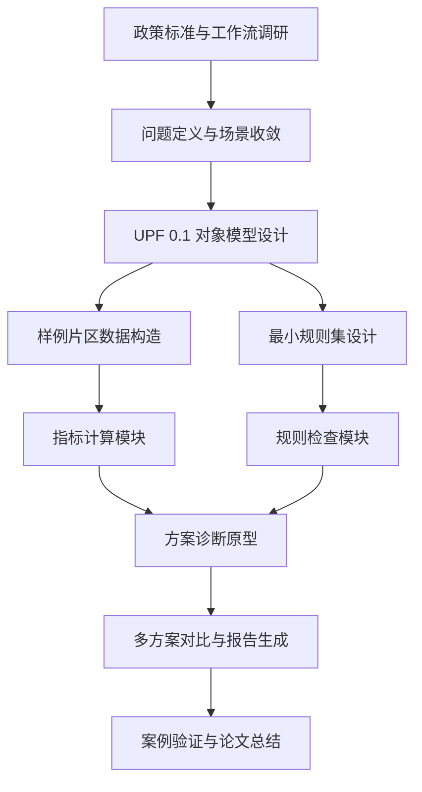
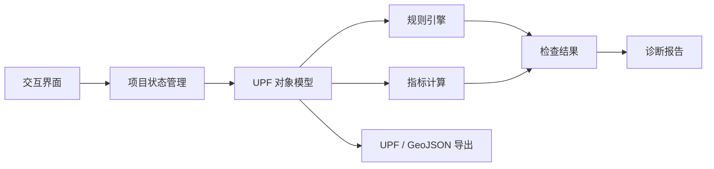

# 硕士毕业设计总体方案

形成日期：2026-05-23  
关联文件：[控规与智能规划助手研究笔记.md](./控规与智能规划助手研究笔记.md)、[规划专属软件与UPF格式设计草案.md](./规划专属软件与UPF格式设计草案.md)、[UPF 0.1 与 MVP 闭环设计.md](./UPF%200.1%20与%20MVP%20闭环设计.md)

## 1. 设计定位

本毕业设计不把目标设定为“做一个 CAD 插件”或“做一个聊天式规划助手”，而是研究并实现一个面向城市更新片区的语义化规划建模与规则辅助审查原型。

核心对象不是线、面、图层，而是：

- 地块
- 街坊
- 道路
- 出入口
- 公共服务设施
- 开放空间
- 控制线
- 规则
- 证据
- 方案

论文与原型共同回答一个问题：

> 如何把城市更新中的空间对象、控制指标、规则依据和方案推演过程结构化，使规划师能够在可计算、可追溯、可比较的环境中进行方案诊断和优化？

## 2. 推荐题目

首选题目：

> 面向城市更新的语义化规划数据模型与规则辅助审查原型研究

备选题目：

- 面向存量更新的规划对象模型与方案诊断系统设计研究
- 基于 UPF 的城市更新片区规则审查与方案推演方法研究
- 面向详细规划编制的语义化空间对象建模与辅助审查工具研究

题目建议使用“原型研究”而不是“平台研究”，这样论文边界更稳，答辩时不会被要求证明已经具备完整工程系统能力。

## 3. 研究对象与范围

### 3.1 研究对象

研究对象为中国城市更新片区中的规划方案诊断过程，重点关注地块级空间对象、开发控制指标、公共服务设施、道路出入口和存量更新约束。

### 3.2 空间尺度

建议聚焦在“街坊或片区级”：

- 面积不宜过大，便于构造样例和手动校核。
- 对象不宜过细，避免陷入建筑施工图或 BIM 深化。
- 结果足够体现城市更新、控规指标、设施补短板和道路出入口等综合问题。

### 3.3 原型范围

第一版只做：

- 地块对象建模
- 指标自动计算
- 人口估算
- 公共服务缺口识别
- 出入口基础风险提示
- 规则检查结果追溯
- 多方案指标对比
- 诊断报告生成

暂不做：

- 完整交通仿真
- 日照和风环境精细模拟
- 真实审批流程
- 多人协同
- 全量国家和地方规范库
- 自动生成法定控规成果

## 4. 研究问题

论文可以围绕四个研究问题展开。

### RQ1：如何表达规划对象

传统 CAD 图纸难以直接表达规划语义。论文需要提出一个最小规划对象模型，将地块、道路、设施、出入口、控制线和方案指标统一到结构化数据中。

输出：

- UPF 0.1 对象模型
- 对象关系图
- 样例 JSON / GeoJSON

### RQ2：如何表达规则与依据

规划审查不是简单数值比较，规则具有地域、版本、层级和依据。论文需要提出规则元数据模型，让每条检查结果能够追溯到规则来源、适用对象、判断逻辑和严重程度。

输出：

- 规则分层模型
- 规则字段定义
- 最小规则集
- 规则检查结果格式

### RQ3：如何支持城市更新语境

城市更新不同于新区建设，常常面对现状高密度、设施不足、历史风貌、交通承载和“优化不恶化”等问题。论文需要把现状基线、更新方式、改善程度和风险提示纳入模型。

输出：

- 现状基线字段
- 更新方式字段
- 改善/恶化判断
- 缺失数据提示

### RQ4：如何验证原型有效

原型不需要证明替代规划师，但要证明它能够提高方案诊断的结构化程度、可追溯性和可比较性。

输出：

- 样例片区
- 至少两个方案
- 规则检查结果
- 诊断报告
- 人工校核表

## 5. 创新点

创新点应克制、明确、可证明。

### 5.1 面向城市更新的语义化规划对象模型

把传统图形图层转换为规划对象，强调对象属性、对象关系、证据来源和方案版本。

可证明方式：

- 给出对象模型表。
- 给出 UPF 样例。
- 展示地块、道路、设施、出入口等对象如何参与规则检查。

### 5.2 规则依据可追溯的辅助审查框架

将规则从“写在论文里的原则”变成可执行、可追溯的数据对象，检查结果显示规则来源、版本、适用范围和计算结果。

可证明方式：

- 展示规则 JSON。
- 展示检查结果中的 `ruleId`、`source`、`observedValue`、`requiredValue`。
- 展示报告如何回溯依据。

### 5.3 面向存量更新的方案诊断闭环

不仅输出合规/不合规，还输出风险等级、设施缺口、优化建议、缺失数据和方案对比。

可证明方式：

- 对比基准方案和优化方案。
- 展示“问题清单 -> 方案调整 -> 再检查”的循环。

### 5.4 小样本可验证的原型系统

通过一个片区样例验证完整流程，而不是只停留在概念设计。

可证明方式：

- 原型截图
- 样例数据
- 规则运行结果
- 报告导出文件

## 6. 技术路线

## 7. 系统架构

建议原型采用本地优先架构，减少服务器和部署负担。

### 7.1 前端

推荐：

- TypeScript
- React
- MapLibre GL 或 OpenLayers
- Turf.js
- Zustand

### 7.2 数据

第一阶段：

- JSON
- GeoJSON
- 本地 `.upf` 压缩包或展开目录

### 7.3 规则引擎

第一阶段不做复杂 DSL，采用：

- 规则元数据 JSON
- TypeScript 判断函数
- 结构化检查结果

### 7.4 报告

第一阶段输出 Markdown 或 HTML，后续再导出 PDF。

## 8. 原型工作流

## 9. 论文结构建议

### 第 1 章 绪论

- 研究背景：城市更新、国土空间详细规划、数字化审查需求。
- 问题提出：CAD 图纸难以表达规划语义，规则和证据难以追溯。
- 研究目标：构建语义化规划数据模型和规则辅助审查原型。
- 研究内容、方法与技术路线。

### 第 2 章 相关研究与实践综述

- 控规与国土空间详细规划数字化。
- 城市更新中的规则、弹性和现状基线。
- GIS、BIM、CAD 在规划中的作用和局限。
- 规划规则引擎、设计代码、智能辅助规划相关研究。

### 第 3 章 面向城市更新的语义化规划对象模型

- 规划对象与传统图层的差异。
- UPF 0.1 总体结构。
- 核心对象：地块、道路、设施、出入口、控制线、方案、证据。
- 对象关系与版本管理。

### 第 4 章 规则辅助审查方法

- 规则分层。
- 规则元数据。
- 检查结果结构。
- 指标计算、人口估算、设施缺口、出入口风险等方法。

### 第 5 章 原型系统设计与实现

- 系统架构。
- 交互流程。
- 数据导入与编辑。
- 指标计算模块。
- 规则检查模块。
- 报告生成模块。

### 第 6 章 案例验证

- 样例片区介绍。
- 基准方案和优化方案。
- 规则检查结果。
- 问题清单和诊断报告。
- 人工校核与有效性分析。

### 第 7 章 结论与展望

- 研究结论。
- 创新点总结。
- 局限性：规则覆盖有限、交通/日照等未精细模拟、样例数量有限。
- 后续方向：规则库扩展、真实数据接入、多方案优化、CAD/GIS/BIM 协同。

## 10. 案例验证设计

建议构造一个虚拟但真实感强的城市更新片区，避免早期被数据获取拖住。

### 10.1 样例片区

包含：

- 1 个规划单元
- 2 到 3 个街坊
- 8 到 12 个地块
- 4 到 8 条道路
- 若干出入口
- 若干公共服务设施
- 1 到 2 条控制线或敏感边界

### 10.2 对比方案

至少两个方案：

- Baseline：现状或初始方案。
- Scenario A：开发强度提升方案。
- Scenario B：公共服务与开放空间优化方案。

### 10.3 验证指标

从三个维度验证：

| 维度 | 验证内容 | 证据 |
|---|---|---|
| 正确性 | 指标计算是否与人工计算一致 | 人工校核表 |
| 可追溯性 | 每个问题是否能追溯到规则和数据 | 检查结果 JSON |
| 有用性 | 是否能帮助发现问题和比较方案 | 诊断报告、问题清单 |

### 10.4 验收口径

原型达到以下标准即可支撑毕业设计：

- 可以打开一个样例项目。
- 可以查看地块、道路、设施和出入口对象。
- 可以修改地块指标。
- 可以一键运行规则检查。
- 可以生成不少于 20 条结构化检查结果。
- 可以导出一份诊断报告。
- 可以比较两个方案的核心指标。

## 11. 开发里程碑

### M1：论文与数据模型定稿

- 明确论文题目。
- 完成 UPF 0.1 对象模型。
- 完成 20 条规则清单。
- 完成样例片区数据结构。

### M2：计算与规则引擎

- 完成地块面积、容积率、建筑密度、绿地率计算。
- 完成人口估算。
- 完成公共服务缺口检查。
- 完成出入口基础风险检查。
- 输出结构化检查结果。

### M3：交互原型

- 完成地图画布。
- 完成对象属性面板。
- 完成问题清单。
- 完成方案切换。
- 完成报告预览。

### M4：案例验证与论文写作

- 完成样例数据。
- 完成两到三个方案。
- 完成图表和截图。
- 完成论文第 3 到第 6 章主体。

## 12. 风险与应对

| 风险 | 表现 | 应对 |
|---|---|---|
| 题目过大 | 试图做完整规划平台 | 聚焦“片区级原型 + 最小规则集” |
| 规范过多 | 规则整理无止境 | 只做可执行的 20 条规则，其他作为展望 |
| 数据难取 | 真实片区数据不完整 | 先构造虚拟样例，再替换真实数据 |
| AI 过度承诺 | 容易被质疑不可靠 | AI 只做解释和报告，不做最终合规判断 |
| 工程量过重 | 地图、编辑、规则、报告都要做 | 先做导入样例和属性编辑，再做绘制功能 |

## 13. 当前最优下一步

接下来最应该做的是：

1. 固化 UPF 0.1 最小对象和字段。
2. 写出 20 条可执行规则。
3. 构造一个样例工程。
4. 开始开发原型的第一个页面：地图画布 + 地块属性面板 + 规则检查按钮。

只要这个闭环跑通，毕业设计就有了“论文主张 + 系统实现 + 案例验证”的核心骨架。

